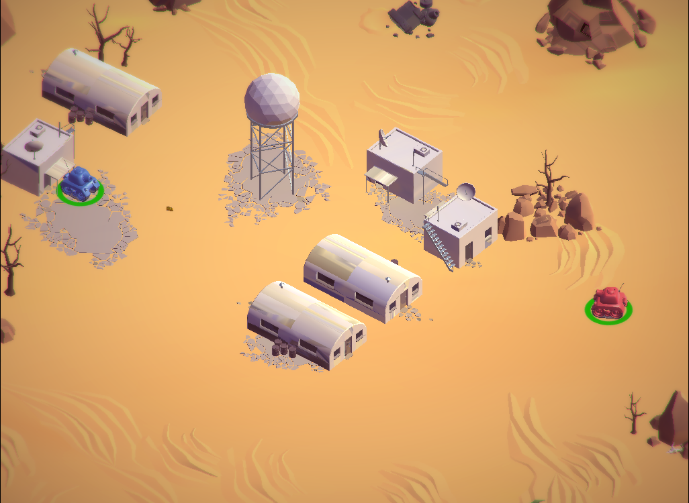

# Tanks
## Isometric game - 2 player game

Tanks is an Windows based 3D isometric game created in Unity 3D game engine

## Features

- Its a 2 player game on same keyboard
- You have to win 5 rounds more than the opponent to win the game 
- Each round ends when one tank depletes the life of another tanks

## Controls 

Controls are straight forward for both tanks 
Blue tank controls are W A S D for movement and Spacebar for shooting 
Red tank controls are arrow keys for movement and Enter for shooting

## Installation

Download the project and run the exe file and that should be it 

## Gameplay Screenshot

